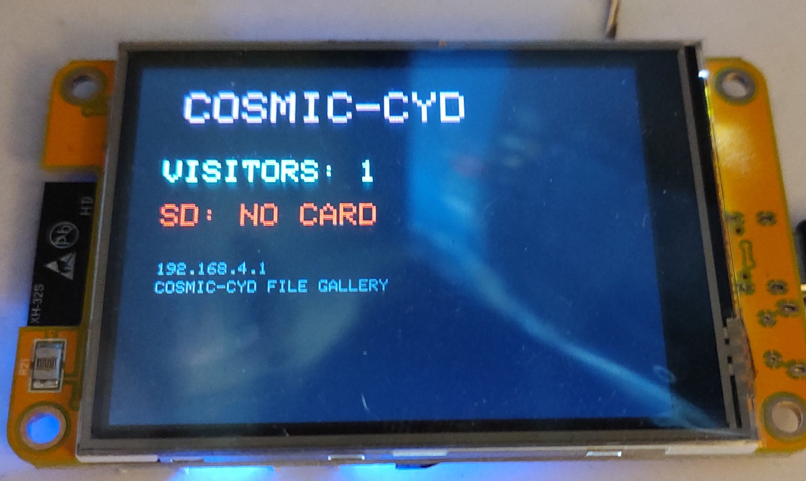

# COSMIC-CYD 🎨

A WiFi captive portal art gallery + SD card file share, running on the **ESP32 CYD (Cheap Yellow Display)**.

No internet required. No accounts. No tracking. Just connect and explore.



---

## What it does

Power it on and your phone sees a WiFi network called **`COSMIC-CYD FILE GALLERY 🎨`**. Connect and you are automatically redirected to the portal. From there you can:

- **Browse & download any file** loaded onto the SD card — images, ZIPs, PDFs, videos, whatever you put on there
- **Explore 72+ generative art & animation modes** running entirely in the browser — no app, no install
- **Read the Free WiFi Safety PSA** — a plain-English guide on how evil portals steal your data (and why this one doesn't)
- **Send a message** to the device operator via the portal (shows up on the display)

The CYD display shows the SSID, IP address, live visitor count, and SD card status at a glance. The RGB LED pulses blue at idle and flashes green when someone new connects.

---

## Hardware

| Component | Details |
|---|---|
| Board | ESP32-2432S028R (CYD — Cheap Yellow Display) |
| Display | ILI9341 · 320×240 · 2.8" TFT |
| Touchscreen | XPT2046 |
| RGB LED | On-board (R=GPIO4, G=GPIO16, B=GPIO17) |
| SD Card slot | Built-in TF/microSD |
| Flash | 4MB (huge_app partition — ~3MB app space) |

### Pin map

| Function | GPIO |
|---|---|
| Display DC | 2 |
| Display CS | 15 |
| Display SCK | 14 |
| Display MOSI | 13 |
| Display MISO | 12 |
| Backlight | 21 |
| Touch CS | 33 |
| Touch IRQ | 36 |
| Touch SCK | 25 |
| Touch MOSI | 32 |
| Touch MISO | 39 |
| SD CS | 5 |
| SD SCK | 18 |
| SD MOSI | 23 |
| SD MISO | 19 |

---

## SD Card setup

1. Format a microSD card as **FAT32**
2. Drop any files you want to share into the **root directory** — images, documents, archives, anything
3. Insert into the CYD and power on
4. The display will show **SD: READY** and visitors can browse and download everything from the portal at `192.168.4.1/gallery`

No folders required. Any file in the root is served. Supports JPG, PNG, GIF, BMP, MP4, MP3, PDF, ZIP, TXT, and everything else — unknown types are served as a generic download.

---

## Portal routes

| Route | Description |
|---|---|
| `/` | Main index — file gallery link + all art modes |
| `/gallery` | Dynamic SD card file browser |
| `/file?n=filename` | View / stream a file from SD |
| `/dl?n=filename` | Force-download a file from SD |
| `/safety` | Free WiFi safety PSA |
| `/api/msg` | GET — poll for operator messages |
| `/api/visitor-msg` | POST — visitor sends message to display |

---

## Art modes (72+)

Organized into categories, all running via Canvas/WebGL in the browser:

**Matrix Rain** — Matrix, Cyber Rain, Binary, Fire Rain, Ice Rain, Storm Rain, Blood Rain, Gold Rain, Void Rain, Phantom, Ripple Rain, Glitch Rain

**Fractals & Mathematics** — Julia Set, Hopalong Attractor, Interference, Voronoi, Strange Attractor, Lissajous, Sierpinski, Spirograph, Barnsley Fern, Apollonian, Sunflower, Quasicrystal, Lorenz, Mandelbrot, Reaction Diffusion, Maze

**Space & Cosmos** — Starfield, Tunnel, Deep Stars, Wormhole, Nebula, Warp Grid

**Generative Art** — Mandala, Plasma, Particles, Aurora, Kaleidoscope, Lava Lamp, Noise Field, Vines, Coral, Flow Field, Crystal Growth, Plasma Globe, Acid Spiral, C-Waves, DNA Helix, Mirror Blob, Goop, Metaballs

**Simulations** — Campfire, Raindrops, Game of Life, Dragon Curve, Cityflow, Fireworks, Lightning, Bounce Balls, Neon Rain, Sand Fall, Retro Geo

**3D** — Rotating Cube, Torus, Hypercube

**Games** — Snake, Breakout, Tetris

---

## Build & flash

```bash
# Clone or download, open in PlatformIO
cd CosmicCYD
pio run --target upload
pio device monitor
```

Requires [PlatformIO](https://platformio.org/). All dependencies are pulled automatically on first build.

---

## Libraries used

- [GFX Library for Arduino](https://github.com/moononournation/Arduino_GFX) — display driver
- [XPT2046_Touchscreen](https://github.com/PaulStoffregen/XPT2046_Touchscreen) — touch controller
- Arduino `SD` library — SD card (bundled with ESP32 Arduino framework)
- `WebServer`, `DNSServer`, `Preferences` — WiFi portal & NVS (bundled)

---

## Notes

- No internet connection is ever made. The portal is fully self-contained on the device.
- Visitor count is stored in NVS flash and survives power cycles.
- The portal HTML, CSS, and all art animations live in flash. The SD card is only for user files.
- Files are streamed directly from SD to the browser — large files work fine without buffering in RAM.
- Built on the [COSMIC-S3](../COSMICQT) T-QT Pro edition and ported to CYD with SD gallery added.
